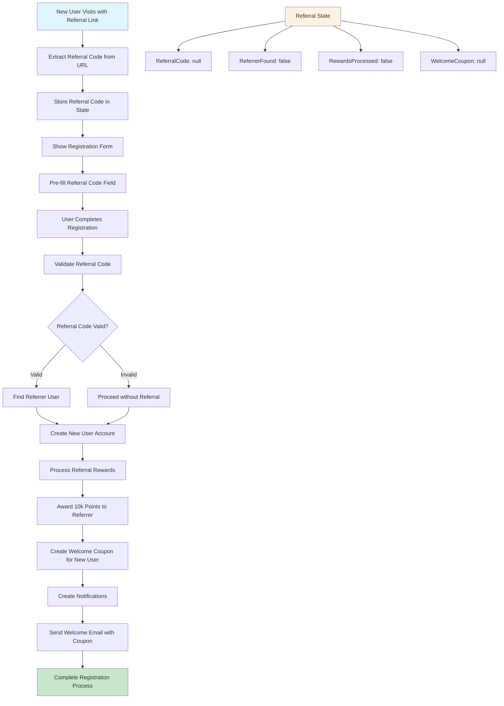
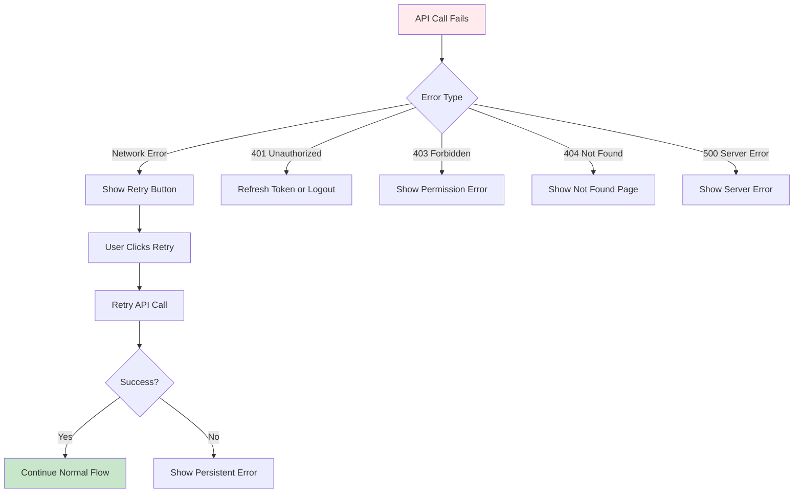

# 🎯 EventHub - User Flow Diagrams & State Management

This document provides comprehensive user flow diagrams for all EventHub features, including state management analysis for each flow.

## 📋 Table of Contents

1. [Authentication Flows](#authentication-flows)
   - [User Registration](#user-registration)
   - [Email Verification](#email-verification)
   - [User Login](#user-login)
   - [Forgot Password](#forgot-password)
   - [Reset Password](#reset-password)
2. [Event Management Flows](#event-management-flows)
   - [Browse Events](#browse-events)
   - [Event Detail View](#event-detail-view)
   - [Create Event](#create-event)
3. [Transaction Flows](#transaction-flows)
   - [Ticket Purchase](#ticket-purchase)
   - [Payment Processing](#payment-processing)
   - [Ticket Delivery](#ticket-delivery)
4. [User Profile Flows](#user-profile-flows)
   - [View Profile](#view-profile)
   - [Edit Profile](#edit-profile)
5. [Referral System Flows](#referral-system-flows)
   - [Referral Registration](#referral-registration)
   - [Referral Rewards](#referral-rewards)

---

## 🔐 Authentication Flows

### User Registration

```mermaid
graph TD
    A[User visits Registration Page] --> B{Form Validation}
    B -->|Valid| C[Check Email Exists]
    B -->|Invalid| A1[Show Validation Errors]
    A1 --> A
    
    C -->|Email Exists| C1[Show "Email Already Registered"]
    C1 --> A
    C -->|Email Available| D[Hash Password]
    
    D --> E[Generate Referral Code]
    E --> F{Has Referral Code?}
    F -->|Yes| G[Process Referral Rewards]
    F -->|No| H[Create User Account]
    G --> H
    
    H --> I[Generate Email Verification Token]
    I --> J[Send Verification Email]
    J --> K[Generate Auth JWT Token]
    K --> L[Return User Data + Token]
    
    L --> M[Update Frontend State]
    M --> N[Store Token in localStorage]
    N --> O[Redirect to Dashboard/Email Verification]
    
    %% State Management
    P[Registration State]
    P --> P1[Loading: false]
    P --> P2[User: null]
    P --> P3[Token: null]
    P --> P4[Errors: {}]
    
    A --> P1
    C --> P5[Loading: true]
    P5 --> P1
    L --> P6[User: userData]
    L --> P7[Token: jwtToken]
    L --> P8[Loading: false]
    
    style A fill:#e1f5fe
    style L fill:#c8e6c9
    style P fill:#fff3e0
```

**State Management for Registration:**
```typescript
interface RegistrationState {
  loading: boolean;
  user: User | null;
  token: string | null;
  errors: {
    email?: string;
    password?: string;
    firstName?: string;
    lastName?: string;
    general?: string;
  };
  isRegistered: boolean;
  verificationSent: boolean;
}
```

### Email Verification

```mermaid
graph TD
    A[User Receives Verification Email] --> B[User Clicks Verification Link]
    B --> C[Extract Token from URL]
    C --> D{Token Valid?}
    
    D -->|Invalid| E[Show "Invalid Token" Error]
    D -->|Valid| F[Verify JWT Token]
    
    F --> G{Token Verification}
    G -->|Success| H[Update User.isVerified = true]
    G -->|Failed| I[Show "Expired Token" Error]
    
    H --> J[Return Success Response]
    J --> K[Update Frontend State]
    K --> L[Show Success Message]
    L --> M[Redirect to Login/Dashboard]
    
    %% Alternative Flow - Resend Verification
    N[User Requests Resend] --> O[Generate New Token]
    O --> P[Send New Verification Email]
    P --> Q[Show "Email Sent" Message]
    
    %% State Management
    R[Verification State]
    R --> R1[Loading: false]
    R --> R2[Verified: false]
    R --> R3[Error: null]
    
    C --> R4[Loading: true]
    H --> R5[Verified: true]
    H --> R6[Loading: false]
    I --> R7[Error: "Token expired"]
    
    style A fill:#e1f5fe
    style M fill:#c8e6c9
    style R fill:#fff3e0
```

**State Management for Email Verification:**
```typescript
interface EmailVerificationState {
  loading: boolean;
  verified: boolean;
  error: string | null;
  resendLoading: boolean;
  resendCooldown: number;
}
```

### User Login

```mermaid
graph TD
    A[User visits Login Page] --> B{Form Validation}
    B -->|Valid| C[Submit Login Request]
    B -->|Invalid| A1[Show Validation Errors]
    A1 --> A
    
    C --> D[Find User by Email]
    D -->|User Not Found| E[Return "Invalid Credentials"]
    D -->|User Found| F[Compare Password Hash]
    
    F -->|Password Invalid| G[Return "Invalid Credentials"]
    F -->|Password Valid| H[Generate JWT Token]
    
    H --> I[Return User Data + Token]
    I --> J[Update Frontend State]
    J --> K[Store Token in localStorage]
    K --> L{User Verified?}
    
    L -->|Not Verified| M[Show Verification Notice]
    L -->|Verified| N[Redirect to Dashboard]
    
    M --> O[Option to Resend Verification]
    
    %% Remember Me Feature
    P[Remember Me Checked] --> K1[Store Token with Longer Expiry]
    
    %% State Management
    Q[Login State]
    Q --> Q1[Loading: false]
    Q --> Q2[User: null]
    Q --> Q3[Token: null]
    Q --> Q4[Errors: {}]
    Q --> Q5[IsAuthenticated: false]
    
    C --> Q6[Loading: true]
    I --> Q7[User: userData]
    I --> Q8[Token: jwtToken]
    I --> Q9[IsAuthenticated: true]
    I --> Q10[Loading: false]
    
    E --> Q11[Errors: {general: "Invalid credentials"}]
    G --> Q11
    
    style A fill:#e1f5fe
    style N fill:#c8e6c9
    style Q fill:#fff3e0
```

**State Management for Login:**
```typescript
interface LoginState {
  loading: boolean;
  user: User | null;
  token: string | null;
  isAuthenticated: boolean;
  errors: {
    email?: string;
    password?: string;
    general?: string;
  };
  rememberMe: boolean;
}
```

### Forgot Password

```mermaid
graph TD
    A[User Clicks "Forgot Password"] --> B[Enter Email Form]
    B --> C{Email Validation}
    C -->|Invalid| C1[Show Validation Error]
    C1 --> B
    C -->|Valid| D[Submit Reset Request]
    
    D --> E[Find User by Email]
    E -->|User Found| F[Generate Reset Token]
    E -->|User Not Found| G[Silent Success Response]
    
    F --> H[Set Token Expiry (1 hour)]
    H --> I[Save Reset Token to DB]
    I --> J[Send Password Reset Email]
    J --> K[Return Success Response]
    
    G --> K
    K --> L[Show "Email Sent" Message]
    L --> M[Hide Email Form]
    M --> N[Show "Check Email" Instructions]
    
    %% Resend Option
    O[Resend Reset Email] --> P{Cooldown Active?}
    P -->|Yes| P1[Show Cooldown Timer]
    P -->|No| D
    
    %% State Management
    Q[ForgotPassword State]
    Q --> Q1[Loading: false]
    Q --> Q2[EmailSent: false]
    Q --> Q3[Error: null]
    Q --> Q4[Cooldown: 0]
    
    D --> Q5[Loading: true]
    K --> Q6[EmailSent: true]
    K --> Q7[Loading: false]
    K --> Q8[Cooldown: 60] 
    
    style A fill:#e1f5fe
    style N fill:#c8e6c9
    style Q fill:#fff3e0
```

**State Management for Forgot Password:**
```typescript
interface ForgotPasswordState {
  loading: boolean;
  emailSent: boolean;
  error: string | null;
  email: string;
  cooldown: number;
  resendLoading: boolean;
}
```

### Reset Password

```mermaid
graph TD
    A[User Clicks Reset Link in Email] --> B[Extract Token from URL]
    B --> C{Token Exists?}
    C -->|No| D[Show "Invalid Link" Error]
    C -->|Yes| E[Show Reset Password Form]
    
    E --> F{Form Validation}
    F -->|Invalid| F1[Show Validation Errors]
    F1 --> E
    F -->|Valid| G[Submit New Password]
    
    G --> H[Find User by Reset Token]
    H -->|Token Not Found| I[Return "Invalid Token"]
    H -->|Token Found| J{Token Expired?}
    
    J -->|Expired| K[Return "Token Expired"]
    J -->|Valid| L[Hash New Password]
    
    L --> M[Update User Password]
    M --> N[Clear Reset Token & Expiry]
    N --> O[Return Success Response]
    
    O --> P[Show Success Message]
    P --> Q[Auto-redirect to Login]
    Q --> R[Clear Form State]
    
    I --> S[Show "Invalid Token" Error]
    K --> T[Show "Token Expired" Error]
    S --> U[Redirect to Forgot Password]
    T --> U
    
    %% State Management
    V[ResetPassword State]
    V --> V1[Loading: false]
    V --> V2[Token: null]
    V --> V3[TokenValid: false]
    V --> V4[Success: false]
    V --> V5[Errors: {}]
    
    B --> V6[Token: extractedToken]
    G --> V7[Loading: true]
    O --> V8[Success: true]
    O --> V9[Loading: false]
    I --> V10[Errors: {general: "Invalid token"}]
    
    style A fill:#e1f5fe
    style Q fill:#c8e6c9
    style V fill:#fff3e0
```

**State Management for Reset Password:**
```typescript
interface ResetPasswordState {
  loading: boolean;
  token: string | null;
  tokenValid: boolean;
  success: boolean;
  errors: {
    password?: string;
    confirmPassword?: string;
    general?: string;
  };
  redirectCountdown: number;
}
```

---

## 🎪 Event Management Flows

### Browse Events

```mermaid
graph TD
    A[User Visits Events Page] --> B[Load Initial Events]
    B --> C[Fetch Events from API]
    C --> D{API Response}
    D -->|Success| E[Display Events Grid]
    D -->|Error| F[Show Error Message]
    
    E --> G[User Interactions Available]
    G --> H[Search Events]
    G --> I[Filter by Category]
    G --> J[Filter by Date]
    G --> K[Filter by Price]
    G --> L[Sort Events]
    
    %% Search Flow
    H --> H1[Update Search Query]
    H1 --> H2[Debounce Search Input]
    H2 --> H3[Fetch Filtered Events]
    H3 --> E
    
    %% Filter Flows
    I --> I1[Update Category Filter]
    I1 --> I3[Fetch Filtered Events]
    J --> J1[Update Date Range]
    J1 --> J3[Fetch Filtered Events]
    K --> K1[Update Price Range]
    K1 --> K3[Fetch Filtered Events]
    
    I3 --> E
    J3 --> E
    K3 --> E
    
    %% Sort Flow
    L --> L1[Update Sort Option]
    L1 --> L2[Re-order Current Events]
    L2 --> E
    
    %% Pagination
    M[Load More Events] --> M1[Fetch Next Page]
    M1 --> M2[Append to Events List]
    M2 --> E
    
    %% Event Interaction
    N[Click Event Card] --> O[Navigate to Event Detail]
    
    %% State Management
    P[Events State]
    P --> P1[Loading: false]
    P --> P2[Events: []]
    P --> P3[Filters: {}]
    P --> P4[SearchQuery: '']
    P --> P5[SortBy: 'date']
    P --> P6[HasMore: true]
    P --> P7[Page: 1]
    
    style A fill:#e1f5fe
    style O fill:#c8e6c9
    style P fill:#fff3e0
```

**State Management for Browse Events:**
```typescript
interface EventsState {
  loading: boolean;
  events: Event[];
  filters: {
    category: string[];
    dateRange: { start: Date | null; end: Date | null };
    priceRange: { min: number; max: number };
    location: string[];
  };
  searchQuery: string;
  sortBy: 'date' | 'price' | 'popularity';
  hasMore: boolean;
  page: number;
  error: string | null;
}
```

### Event Detail View

```mermaid
graph TD
    A[User Visits Event Detail Page] --> B[Extract Event ID from URL]
    B --> C[Fetch Event Data in Parallel]
    C --> D[API Calls: Event + Tickets + Reviews]
    D --> E{All APIs Success?}
    
    E -->|Error| F[Show Error State]
    E -->|Success| G[Display Event Information]
    
    G --> H[User Interactions Available]
    H --> I[Select Tickets]
    H --> J[Add to Favorites]
    H --> K[Share Event]
    H --> L[View Reviews]
    H --> M[Purchase Tickets]
    
    %% Ticket Selection Flow
    I --> I1[Update Selected Tickets]
    I1 --> I2[Calculate Total Price]
    I2 --> I3[Update Purchase Button State]
    
    %% Favorites Flow
    J --> J1[Toggle Favorite Status]
    J1 --> J2[Update Local State]
    J2 --> J3[Sync with Backend]
    
    %% Share Flow
    K --> K1[Open Share Modal]
    K1 --> K2[Generate Share URLs]
    K2 --> K3[Copy Link / Social Share]
    
    %% Reviews Flow
    L --> L1[Toggle Reviews Visibility]
    L1 --> L2[Load More Reviews if Needed]
    
    %% Purchase Flow
    M --> M1{Has Selected Tickets?}
    M1 -->|No| M2[Show "Select Tickets" Error]
    M1 -->|Yes| M3[Navigate to Checkout]
    
    %% State Management
    N[EventDetail State]
    N --> N1[Loading: true]
    N --> N2[Event: null]
    N --> N3[Tickets: []]
    N --> N4[Reviews: []]
    N --> N5[SelectedTickets: []]
    N --> N6[IsFavorite: false]
    N --> N7[ShowShareModal: false]
    N --> N8[ShowAllReviews: false]
    
    style A fill:#e1f5fe
    style M3 fill:#c8e6c9
    style N fill:#fff3e0
```

**State Management for Event Detail:**
```typescript
interface EventDetailState {
  loading: boolean;
  event: Event | null;
  tickets: Ticket[];
  reviews: Review[];
  selectedTickets: TicketSelection[];
  isFavorite: boolean;
  showShareModal: boolean;
  showAllReviews: boolean;
  error: string | null;
}
```

---

## 💳 Transaction Flows

### Ticket Purchase

```mermaid
graph TD
    A[User Clicks "Purchase Tickets"] --> B{User Authenticated?}
    B -->|No| C[Redirect to Login]
    B -->|Yes| D[Validate Selected Tickets]
    
    D --> E{Tickets Available?}
    E -->|No| F[Show "Tickets Unavailable" Error]
    E -->|Yes| G[Navigate to Checkout Page]
    
    G --> H[Display Order Summary]
    H --> I[Apply Coupon/Points Form]
    I --> J[Select Payment Method]
    
    %% Coupon Flow
    K[Apply Coupon] --> K1[Validate Coupon Code]
    K1 --> K2{Coupon Valid?}
    K2 -->|Invalid| K3[Show "Invalid Coupon"]
    K2 -->|Valid| K4[Apply Discount]
    K4 --> K5[Update Total Price]
    
    %% Points Flow
    L[Use Points] --> L1{Sufficient Points?}
    L1 -->|No| L2[Show Points Balance Error]
    L1 -->|Yes| L3[Apply Points Discount]
    L3 --> L4[Update Total Price]
    
    J --> M[Confirm Purchase]
    M --> N[Create Transaction Record]
    N --> O[Reserve Tickets Temporarily]
    O --> P[Generate Payment Instructions]
    P --> Q[Send Confirmation Email]
    Q --> R[Show Payment Instructions]
    
    %% State Management
    S[Purchase State]
    S --> S1[Loading: false]
    S --> S2[OrderSummary: null]
    S --> S3[AppliedCoupon: null]
    S --> S4[PointsUsed: 0]
    S --> S5[PaymentMethod: null]
    S --> S6[Transaction: null]
    
    style A fill:#e1f5fe
    style R fill:#c8e6c9
    style S fill:#fff3e0
```

### Payment Processing

```mermaid
graph TD
    A[User Receives Payment Instructions] --> B[User Makes Bank Transfer]
    B --> C[User Uploads Payment Proof]
    C --> D[Upload File to Server]
    D --> E{Upload Success?}
    
    E -->|Error| F[Show Upload Error]
    E -->|Success| G[Update Transaction Status]
    G --> H[Notify Admin for Review]
    
    %% Admin Review Process
    I[Admin Reviews Payment] --> J{Payment Valid?}
    J -->|Invalid| K[Reject Payment]
    J -->|Valid| L[Approve Payment]
    
    K --> K1[Update Status: REJECTED]
    K1 --> K2[Send Rejection Email]
    K2 --> K3[Release Reserved Tickets]
    
    L --> L1[Update Status: CONFIRMED]
    L1 --> L2[Confirm Ticket Reservation]
    L2 --> L3[Generate Ticket Images]
    L3 --> L4[Send Ticket Email with JPG]
    L4 --> L5[Update User Points]
    L5 --> L6[Process Referral Rewards]
    
    %% User Status Check
    M[User Checks Payment Status] --> N[Fetch Transaction Status]
    N --> O{Status Updated?}
    O -->|Pending| P[Show "Under Review"]
    O -->|Confirmed| Q[Show Success + Tickets]
    O -->|Rejected| R[Show Rejection + Retry Option]
    
    %% State Management
    S[Payment State]
    S --> S1[UploadLoading: false]
    S --> S2[PaymentProof: null]
    S --> S3[TransactionStatus: 'PENDING']
    S --> S4[StatusLoading: false]
    S --> S5[Tickets: []]
    
    style A fill:#e1f5fe
    style Q fill:#c8e6c9
    style S fill:#fff3e0
```

### Ticket Delivery

```mermaid
graph TD
    A[Payment Confirmed] --> B[Generate Ticket Data]
    B --> C[Create QR Codes for Each Ticket]
    C --> D[Generate Ticket Images (JPG)]
    D --> E[Create Email with Attachments]
    E --> F[Send Ticket Email to User]
    
    F --> G[Update Transaction Status]
    G --> H[Create Notification for User]
    H --> I[User Receives Email]
    
    I --> J[User Downloads Ticket Images]
    J --> K[User Saves to Mobile Wallet]
    
    %% Ticket Validation Flow
    L[Event Day - Scan QR Code] --> M[Validate QR Code]
    M --> N{QR Code Valid?}
    N -->|Invalid| O[Show Error]
    N -->|Valid| P[Mark Ticket as Used]
    P --> Q[Allow Entry]
    
    %% Resend Ticket Flow
    R[User Requests Resend] --> S[Verify Transaction Status]
    S --> T{Transaction Confirmed?}
    T -->|No| U[Show "Payment Not Confirmed"]
    T -->|Yes| V[Resend Ticket Email]
    
    %% State Management
    W[Ticket State]
    W --> W1[Generating: false]
    W --> W2[Tickets: []]
    W --> W3[EmailSent: false]
    W --> W4[QRCodes: []]
    
    style A fill:#e1f5fe
    style Q fill:#c8e6c9
    style W fill:#fff3e0
```

---

## 👤 User Profile Flows

### View Profile

```mermaid
graph TD
    A[User Navigates to Profile] --> B{User Authenticated?}
    B -->|No| C[Redirect to Login]
    B -->|Yes| D[Fetch User Profile Data]
    
    D --> E[Fetch User Statistics]
    E --> F[Fetch Transaction History]
    F --> G[Fetch Point History]
    G --> H[Fetch Referral Data]
    
    H --> I[Display Profile Information]
    I --> J[User Profile Sections]
    
    J --> K[Personal Information]
    J --> L[Statistics Dashboard]
    J --> M[Transaction History]
    J --> N[Points & Rewards]
    J --> O[Referral System]
    J --> P[Account Settings]
    
    %% Profile Interactions
    K --> K1[Edit Profile Button]
    M --> M1[View Transaction Details]
    N --> N1[View Point History]
    O --> O1[Share Referral Code]
    P --> P1[Change Password]
    P --> P2[Upload Avatar]
    
    %% State Management
    Q[Profile State]
    Q --> Q1[Loading: true]
    Q --> Q2[User: null]
    Q --> Q3[Statistics: null]
    Q --> Q4[Transactions: []]
    Q --> Q5[PointHistory: []]
    Q --> Q6[ReferralData: null]
    
    style A fill:#e1f5fe
    style I fill:#c8e6c9
    style Q fill:#fff3e0
```

---

## 🎁 Referral System Flows

### Referral Registration



### Referral Rewards

```mermaid
graph TD
    A[User Shares Referral Code] --> B[Generate Referral Link]
    B --> C[Share via Social/Copy Link]
    C --> D[Friend Clicks Referral Link]
    
    D --> E[Friend Registers Successfully]
    E --> F[Automatic Reward Processing]
    F --> G[Referrer Gets 10,000 Points]
    G --> H[New User Gets 10% Coupon]
    H --> I[Both Get Notifications]
    
    I --> J[Update Referral Statistics]
    J --> K[Send Reward Emails]
    
    %% Referral Dashboard
    L[User Views Referral Dashboard] --> M[Show Referral Statistics]
    M --> N[Total Referrals Made]
    N --> O[Points Earned from Referrals]
    O --> P[Referral History]
    P --> Q[Generate New Referral Links]
    
    %% State Management
    R[ReferralRewards State]
    R --> R1[TotalReferrals: 0]
    R --> R2[PointsEarned: 0]
    R --> R3[ReferralHistory: []]
    R --> R4[ReferralLink: '']
    
    style A fill:#e1f5fe
    style K fill:#c8e6c9
    style R fill:#fff3e0
```

---

## 📊 Global State Management Architecture

```mermaid
graph TD
    A[React Context Providers] --> B[AuthContext]
    A --> C[EventsContext]
    A --> D[TransactionContext]
    A --> E[ProfileContext]
    A --> F[NotificationContext]
    
    B --> B1[User State]
    B --> B2[Authentication Status]
    B --> B3[Tokens Management]
    
    C --> C1[Events List]
    C --> C2[Filters & Search]
    C --> C3[Current Event Detail]
    
    D --> D1[Cart State]
    D --> D2[Transaction History]
    D --> D3[Payment Status]
    
    E --> E1[User Profile]
    E --> E2[Points & Rewards]
    E --> E3[Referral Data]
    
    F --> F1[Toast Messages]
    F --> F2[Error Notifications]
    F --> F3[Success Alerts]
    
    %% Local Storage Persistence
    G[Local Storage] --> G1[Auth Token]
    G --> G2[User Preferences]
    G --> G3[Cart Items]
    
    %% API State Management
    H[React Query/SWR] --> H1[Caching]
    H --> H2[Background Updates]
    H --> H3[Error Handling]
    
    style A fill:#e1f5fe
    style G fill:#c8e6c9
    style H fill:#fff3e0
```



---

## 🎯 State Management Best Practices

### 1. **Authentication State**
```typescript
// Centralized auth state with persistence
const useAuthState = () => ({
  user: User | null,
  token: string | null,
  isAuthenticated: boolean,
  loading: boolean,
  error: string | null
});
```

### 2. **Form State Management**
```typescript
// Using Formik for complex forms
const useFormState = () => ({
  values: FormValues,
  errors: FormErrors,
  touched: FormTouched,
  isSubmitting: boolean,
  isValid: boolean
});
```

### 3. **API State with React Query**
```typescript
// Cached API calls with automatic updates
const useEventDetail = (eventId: string) =>
  useQuery({
    queryKey: ['event', eventId],
    queryFn: () => api.events.getById(eventId),
    staleTime: 5 * 60 * 1000, // 5 minutes
    cacheTime: 10 * 60 * 1000 // 10 minutes
  });
```

### 4. **Global State Patterns**
```typescript
// Context + Reducer pattern for complex state
const useGlobalState = () => {
  const [state, dispatch] = useReducer(globalReducer, initialState);
  
  return {
    state,
    actions: {
      login: (userData) => dispatch({type: 'LOGIN', payload: userData}),
      logout: () => dispatch({type: 'LOGOUT'}),
      updateProfile: (data) => dispatch({type: 'UPDATE_PROFILE', payload: data})
    }
  };
};
```

---

## 🔄 Error Handling & Recovery Flows

### Network Error Recovery


This comprehensive diagram system provides complete visibility into EventHub's user flows and state management patterns, enabling better analysis and optimization of the user experience and application architecture.
